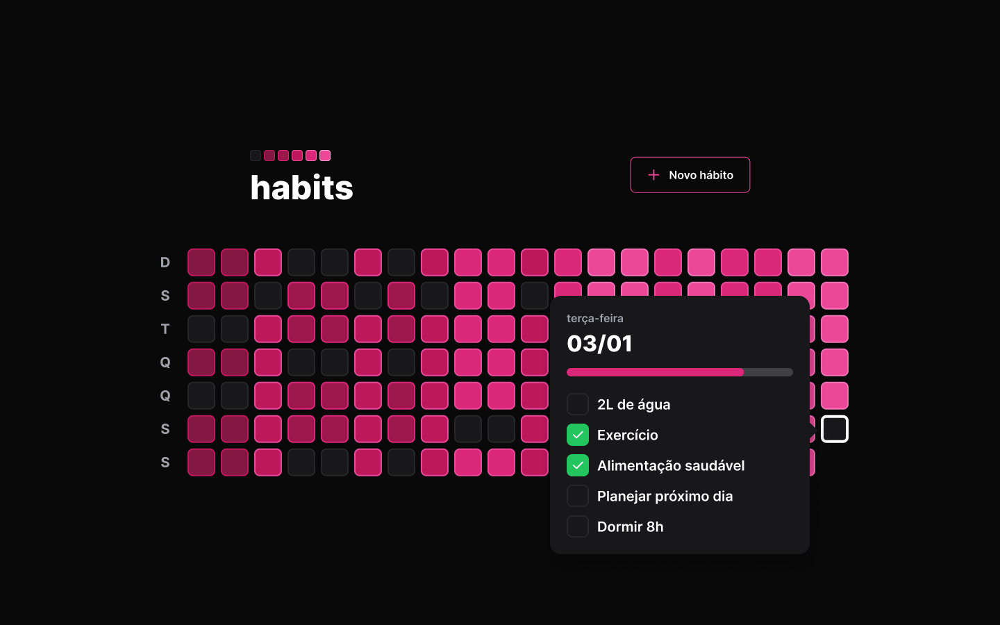

# habits

<h3 align="center">
      <br>
    
    
  
 ##  🪄 Introdução
 
O projeto habits é totalmente fullstack com o back-end em NodeJS, TypeScript e Banco de dados ORM Prisma e front-end em React, Typescript + Vite. Habits é um projeto que te ajuda a criar e manter bons hábitos, permitindo que você alcance os seus objetivos de longo prazo. ele conta com uma interface bonita, moderna e simples, possui uma interface minimalista bem simples de usar.


## <dt> :gear: Configuração de desenvolvimento </dt>
<p>Clone o repositório e execute os seguintes comandos:</p>

<h3>Front-end & Back-end</h3>

```shell 
  # Execute yarn para instalar as dependências
  $ npm install
  
  # Para executar a aplicação
  $ npm run dev

```

## :desktop_computer:	 Tecnologias & Dependências utilizadas
- [ReactJs](https://reactjs.org/)
- [Vite](https://vitejs.dev/)
- [Typescript](https://www.typescriptlang.org/)
- [NodeJS](https://nodejs.org/en/)
- [Tailwindcss](https://tailwindcss.com/)
- [postcss](https://postcss.org/)
- [Fastify](https://www.fastify.io/)
- [Prisma](https://www.prisma.io/)
- [dayjs](https://www.npmjs.com/package/dayjs)
- [zod](https://www.npmjs.com/package/zod)
- [axios](https://axios-http.com/ptbr/docs/intro)
- [Radix UI](https://www.radix-ui.com/)
- [phosphor-react](https://phosphoricons.com/)


<h3 align="center">
<h1>Imagens do projeto</h1>
<h3>Page - Home</h2>
<br>

<h3 align="center">
<h3>Page - Criação de um novo hábito</h2>
<br>
